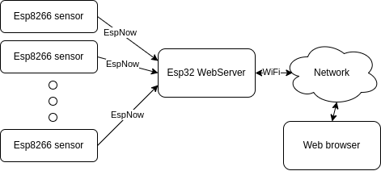
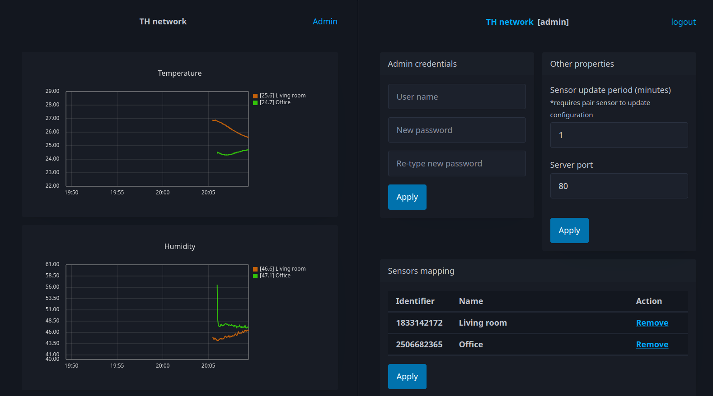
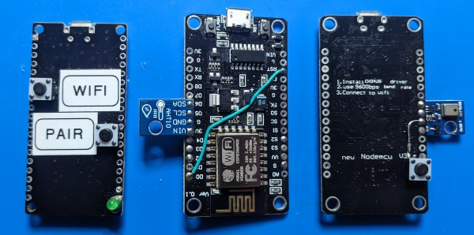

# ThNetwork
Implementation of sensors network for capturing temperature and humidity data. 

# How it works
This project entails ESP8266-based transmitters that retrieve data from ATH10 sensors (for temperature and humidity) and transmit it via the ESP-NOW protocol to a host board. The host, built on ESP32, features a web interface displaying data readings on charts and providing administration page.



## Charts and admin view


# Setup
This project utilizes `PlatformIO` as its build system and includes two main targets: `host` for the `esp32` board and `transmitter` for the `esp8266`. The `CMakeLists.txt` file within the project is solely intended for building unit tests.

## Boards preparation
This project was developed using prototype boards, including the NodeMCU (ESP8266) and Node32S (ESP32).

The transmitter board features an additional connection where D0 is linked with the reset pin. This connection is essential because the transmitter enters deep sleep mode for a specified period after data transmission. Without this connection, the board will be unable to wake up.

## Flashing boards
To begin, open the project in `PlatformIO`, select the target corresponding to your board (transmitter or host), and proceed to flash the board.
If you've already prepared an ESP8266 board with a link between D0 and RST (as described in the "Boards Preparation" section), you'll need to press the "flash" button while flashing.

## First setup
During initial startup, the host will establish an access point named TH-NETWORK. Connect to this access point and navigate to the address `192.168.4.1` to configure the Wi-Fi connection. Upon completion, the board will reboot and connect to the designated network. Now, you should be able to access the web interface by typing the IP address of your board into a web browser. This IP address should be displayed in the serial output by the host board during startup.

## Pairing
To initiate pairing on the host, press the pair button. Then, hold down the pair button on the transmitter and simultaneously click reset. Once paired, the transmitter will become visible in the Admin view, allowing you to modify its name as needed.

# Default pinout
Pinout customization can be achieved by modifying:
 - Host: `src/host/BoardConfiguration.hpp`
 - Transmitter: `src/transmitter/BoardConfiguration.hpp`

## Default configuration
### Transmitter (nodemcu)
ATH10
 - SCL: D5
 - SDA: D6

Pair button
 - pin: D2

### Host (node32s)
Buttons
 - wifi: 14
 - pair/factory reset: 18

Led
 - pin: 23

# Tests
Unit tests are written using cpputest. You can build them using CMake:
```
$ cmake -B build
$ cmake --build build
$ ./build/HostUTs && ./build/TransmitterUTs && ./build/CommonUTs
```